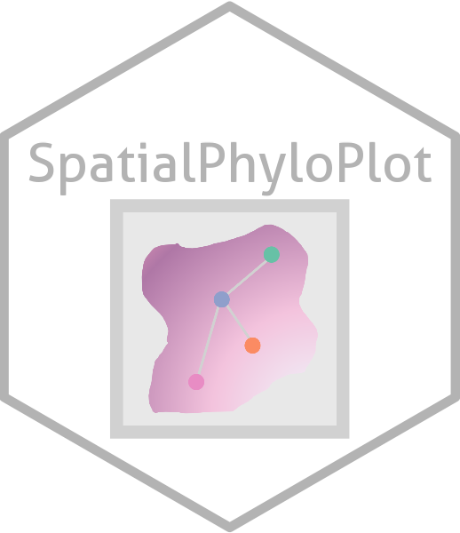
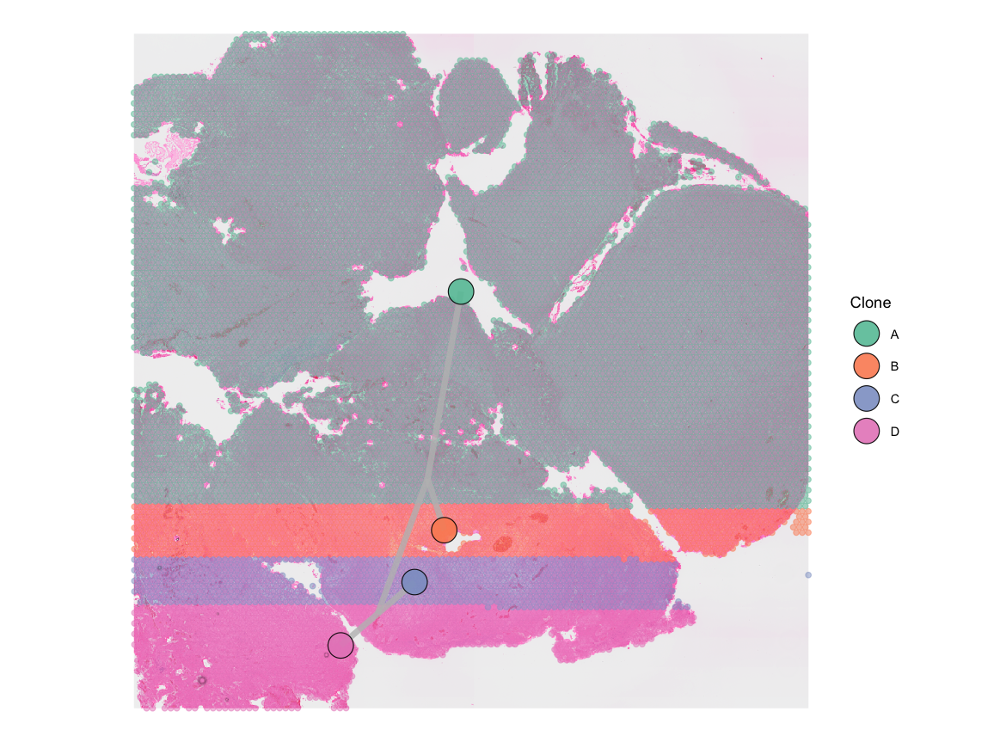
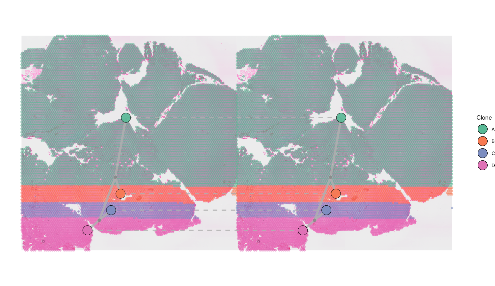
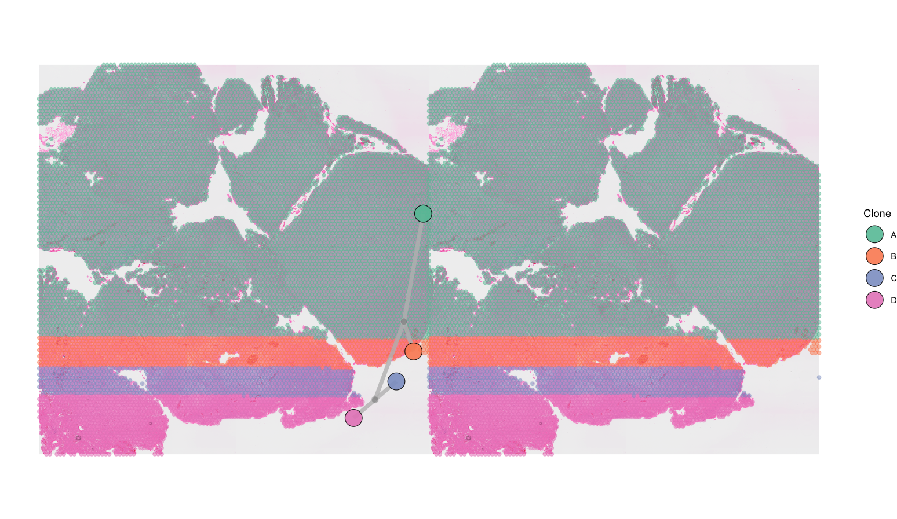

# SpatialPhyloPlot
An R package for plotting phylogenetic trees from Visium 10X spatial transcriptomics data in an automated way. 

`SpatialPhyloPlot` is a work in progress - to follow along please watch and star this repository or check back for updates!

<!-- badges: start -->
[](https://codecov.io/gh/Wedge-lab/SpatialPhyloPlot)
<!-- badges: end -->



- [SpatialPhyloPlot](#spatialphyloplot)
  - [Citation](#citation)
  - [Introduction](#introduction)
  - [Installation](#installation)
  - [Example](#example)
    - [Static single sample](#static-single-sample)
    - [Static multi-sample](#static-multi-sample)
  - [Future Developments](#future-developments)

## Introduction
`SpatialPhyloPlot` is an R package for automated plotting of phylogenetic trees derived from spatial transcriptomic data on top of the spatial transcriptomics tissue image. The package is currently compatible with Visium 10X data and phylogenetic trees provided in the Newick file format, such as those produced by MEDICC2. 

Please keep an eye out for our upcoming pre-print!

## Citation
If you use `SpatialPhyloPlot` in your work please cite the package as:

  Jakobsdottir M (2025). SpatialPhyloPlot: Automated Plotting of Phylogenetic Trees on Spatial
  Transcriptomics Data. R package version [insert correct version here], <https://github.com/Wedge-lab/SpatialPhyloPlot>.

A BibTeX entry for LaTeX users is
```
  @Manual{,
    title = {SpatialPhyloPlot: Automated Plotting of Phylogenetic Trees on Spatial Transcriptomics Data},
    author = {Maria Jakobsdottir},
    year = {2025},
    note = {R package version [insert correct version here]},
    url = {https://github.com/Wedge-lab/SpatialPhyloPlot},
  }
```

A citation with the version used can be generated by running:
```
citation("SpatialPhyloPlot")
```

## Installation

To install `SpatialPhyloPlot` run:
```
if (!require("devtools", quietly = TRUE))
    install.packages("devtools")
devtools::install_github("Wedge-lab/SpatialPhyloPlot", dependencies = TRUE)
```
## Example

`SpatialPhyloPlot` has 6 essential inputs:

- `visium_version`: `V1` or `V2`
- `newick_file`: Path to the `.new` phylogenetic tree
- `image_file`: Path to `tissue_hires_image.png`
- `tissue_positions_file`: Path to `tissue_positions_list.csv`
- `scale_factors`: Path to `scalefactors_json.json`
- `clone_df`: A data frame linking Visium barcodes to phylogenetic tree clones

We'll demonstrate how to run `SpatialPhyloPlot` with some example data provided with the package. The [Visium 10X data is the Human Brain Cancer 11 mm Capture Area (FFPE) data set provided by 10X Genomics](https://www.10xgenomics.com/datasets/human-brain-cancer-11-mm-capture-area-ffpe-2-standard). 
**Please note: the phylogenetic tree and clones provided are dummy data intended for illustration purposes only and do not represent a formal copy number of phylogenetic tree analysis of this sample.**
```
library(SpatialPhyloPlot)
# Get directory of files provided with SpatialPhyloPlot
newick_file <- system.file("extdata", "demo.new", package = "SpatialPhyloPlot")
image_file <- system.file("extdata", "tissue_hires_image.png", package = "SpatialPhyloPlot")
tissue_positions_file <- system.file("extdata", "tissue_positions.csv", package = "SpatialPhyloPlot")
scale_factors_file <- system.file("extdata", "scalefactors_json.json", package = "SpatialPhyloPlot")
clone_df <- readRDS(system.file("extdata", "clone_df.rds", package = "SpatialPhyloPlot"))
```

### Static single sample

```
SpatialPhyloPlot(visium_version = "V2",
                 newick_file = newick_file,
                 image_file = image_file,
                 tissue_positions_file = tissue_positions_file,
                 scale_factors = scale_factors_file,
                 clone_df = clone_df,
                 clone_group_column = "group",
                 clone_barcode_column = "Barcode",
                 point_alpha = 0.5,
                 )
```




### Static multi-sample
If you want to plot a separate phylogenetic tree linking common clones between your two samples we recommend using the `plot_connections = TRUE`, `plot_internal_nodes = TRUE`, and `shared_clones = TRUE` options. 
```
SpatialPhyloPlot(visium_version = "V2",
                 newick_file = newick_file,
                 image_file = image_file,
                 tissue_positions_file = tissue_positions_file,
                 scale_factors = scale_factors_file,
                 clone_df = clone_df,
                 clone_group_column = "group",
                 clone_barcode_column = "Barcode",
                 image_file_left = image_file,
                 tissue_positions_file_left = tissue_positions_file,
                 scale_factors_left = scale_factors_file,
                 clone_df_left = clone_df,
                 multisample = TRUE,
                 plot_connections = TRUE,
                 plot_internal_nodes = TRUE,
                 shared_clones = TRUE,
                 point_alpha = 0.5)
```



If you want to plot a single joint phylogenetic tree we recommend using the `plot_internal_nodes = TRUE` and `shared_clones = FALSE` options. 
```
SpatialPhyloPlot(visium_version = "V2",
                 newick_file = newick_file,
                 image_file = image_file,
                 tissue_positions_file = tissue_positions_file,
                 scale_factors = scale_factors_file,
                 clone_df = clone_df,
                 clone_group_column = "group",
                 clone_barcode_column = "Barcode",
                 image_file_left = image_file,
                 tissue_positions_file_left = tissue_positions_file,
                 scale_factors_left = scale_factors_file,
                 clone_df_left = clone_df,
                 multisample = TRUE,
                 plot_internal_nodes = TRUE,
                 shared_clones = FALSE,
                 point_alpha = 0.5)
```



## Future Developments
If you have an idea for a feature that you would like to see implemented in this package please submit a [GitHub issue](https://github.com/Wedge-lab/SpatialPhyloPlot/issues) and we'll see what we can do! :)
